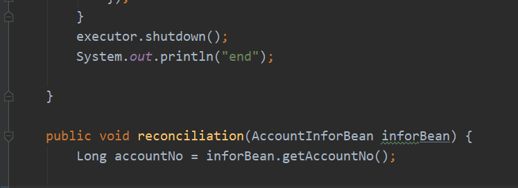

```java
@Data
@TableName("pr_print_cost_config")
public class PrintCostConfigModel extends Model<PrintCostConfigModel> implements Serializable {
	private static final long serialVersionUID = 1L;

	/**
	 * id
	 */
	@TableId(type = IdType.AUTO)
	private Integer id;
	/**
	 * 项目名称
	 */
	private String entryName;
	/**
	 * 明细
	 */
	private String detail;
	/**
	 * 单价（元/万张）
	 */
	private BigDecimal unitPrice;

}

```

